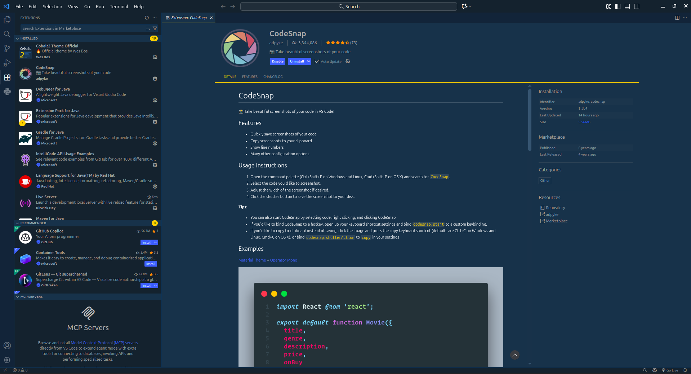
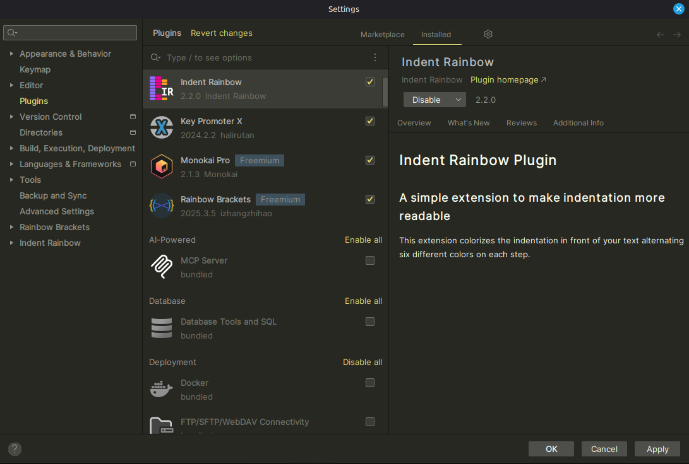

# Punto 2: Gestión de módulos y extensiones en el entorno de desarrollo

## IDEs utilizados
- **IDE 1:** Fleet
- **IDE 2:** IntelliJ IDEA

## Descripción de la tarea

- En Fleet: Al ser un IDE bastante nuevo, carece de muchas extensiones que si podríamos encontrar en otros IDE como Visual Studio Code, las que posee mayormente son para poder ejecutar los diferentes lenguajes que soporta. Una de las extensiones que he conseguido encontrar es Rainbow *Brackets for Fleet*.

- En IntelliJ: Al ser un IDE que lleva en funcionamiento varios años podremos encontrar una mayor variedad de plugins. Yo he elegido *Kotest*, que vendría a ser un plugin muy similar al Pytest de Python pero para Kotlin.

## Respuestas a preguntas evaluativas

### Pregunta 1: ¿Cómo fue el proceso de instalación de extensiones o módulos en cada IDE?
[Tu respuesta aquí]

### Pregunta 2: ¿Qué beneficios proporcionan las extensiones o plugins que instalaste para el desarrollo de tus proyectos?
[Tu respuesta aquí]

## Evidencias

## Observaciones
[Comentarios adicionales]
