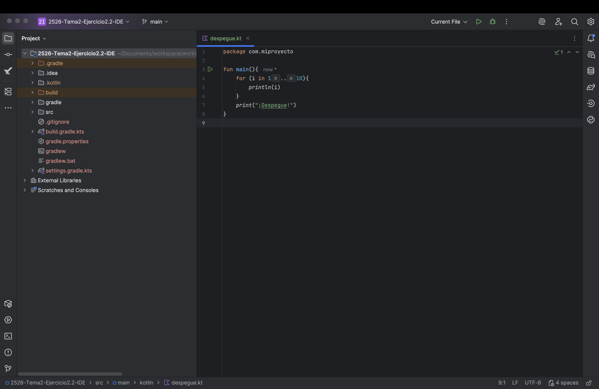
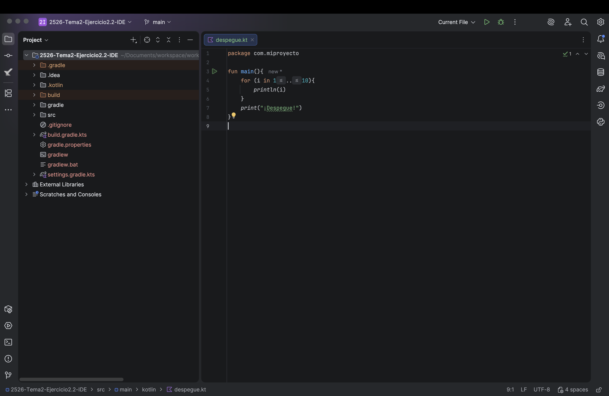

# Punto 3: Personalización y automatización del entorno

## IDEs utilizados
- **IDE 1:** Fleet
- **IDE 2:** IntelliJ IDEA

## Descripción de la tarea
[Explica qué personalizaciones realizaste: tema, atajos de teclado, automatización de tareas]

### Personalizaciones realizadas
- Tema: *Dark Purple* (en **Fleet**) y *Island Dark* (en **IntelliJ IDEA**)
- Atajos de teclado: Abrir la terminal (⌘ + M) en **Fleet**. Refactorizar > Rename (⌥ + O) en **IntelliJ IDEA**
- Automatización: Refactorizar el codigo al guardar el fichero (en **Fleet**). Realizar los test en Kotlin con *Kotest* al hacer un commit (en **IntelliJ IDEA**).

## Respuestas a preguntas evaluativas

### Pregunta 1: ¿Qué aspectos del entorno personalizaste y cómo mejoró tu experiencia de desarrollo?

Personalizar los **temas** me ayudo a sentirme mas cómodo a la hora de programar, ya que lo puse con colores con los que yo me siento mas cómodo a la hora de ponerme delante de una pantalla.

Personalizar los **atajos del teclado** me ayudo a aprovechar mejor el tiempo, ya que los atajos que puse son para poder acceder de forma mas cómoda a un atajo qe antes se me hacia un poco complicado de acceder (como el caso de *Fleet*) o directamente imposible por como es mi teclado (como el caso *IntelliJ IDEA*)

### Pregunta 2: ¿Cómo configuraste la automatización de tareas y en qué te benefició durante el trabajo?

La *automatizacion del formateo* me ayuda a dejar las cosas mas "bonitas" sin tener que estar tan pediente. Hace que luego el código sea mas legible si se me paso algun detalle a la hora de escribirlo.

La *automatización de los test* me parece muy util porque ahorra muchisimo tiempo, ya que no tengo yo que hacer los test de forma manual, sino que al hacer el commit me los hace automaticamente y no me tengo que preocupar.

## Evidencias
**ANTES:**

**DESPUÉS:**

**AUTOMATIZACIÓN:**

