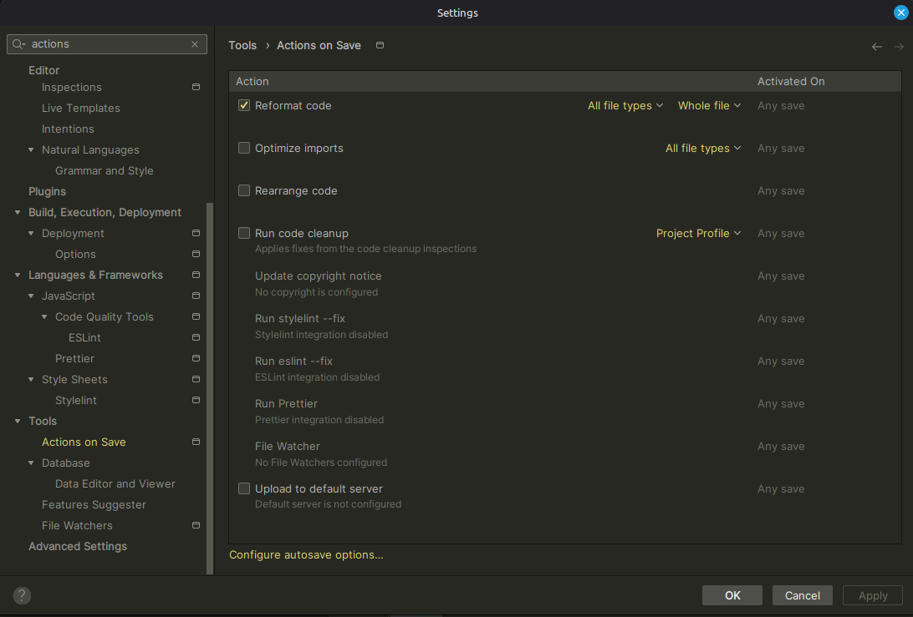

# Punto 3: Personalización y automatización del entorno

## IDEs utilizados
- **IDE 1:** Fleet
- **IDE 2:** IntelliJ IDEA

## Descripción de la tarea
[Explica qué personalizaciones realizaste: tema, atajos de teclado, automatización de tareas]

### Personalizaciones realizadas
- Tema: *Dark Purple* (en **Fleet**) y *Island Dark* (en **IntelliJ IDEA**)
- Atajos de teclado: Abrir la terminal (⌘ + M) en **Fleet**. Refactorizar > Rename (⌥ + O) en **IntelliJ IDEA**
- Automatización: [Tareas automatizadas, ej: ejecutar tests, compilar código]

## Respuestas a preguntas evaluativas

### Pregunta 1: ¿Qué aspectos del entorno personalizaste y cómo mejoró tu experiencia de desarrollo?
[Tu respuesta aquí]

### Pregunta 2: ¿Cómo configuraste la automatización de tareas y en qué te benefició durante el trabajo?
[Tu respuesta aquí]

## Evidencias
**ANTES:**

**DESPUÉS:**

**AUTOMATIZACIÓN:**

