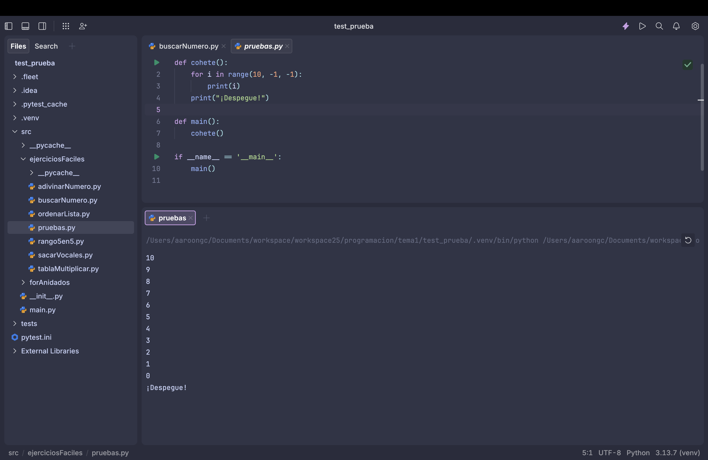
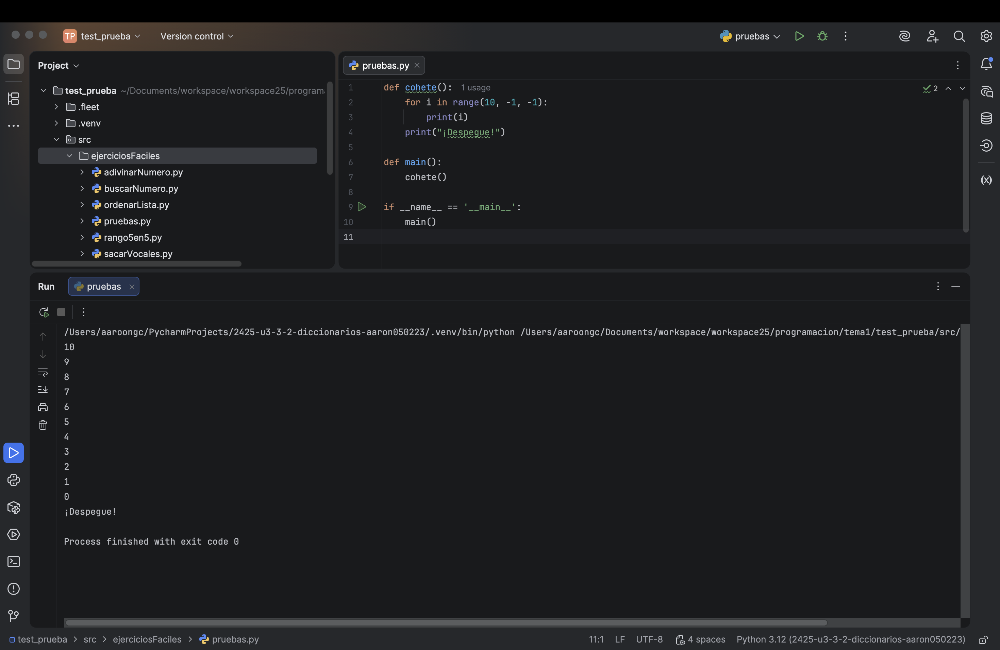

# Punto 6: Generación de ejecutables con diferentes IDEs a partir del mismo código fuente

## IDEs utilizados
- **IDE 1:** Fleet
- **IDE 2:** Pycharm

## Descripción de la tarea
Programa "cuenta atrás" en Python que cuenta de 10 a 0 y luego imprime "¡Despegue!"

## Código implementado

```python
def cohete():
    for i in range(10, -1, -1):
        print(i)
    print("¡Despegue!")

def main():
    cohete()

if __name__ == '__main__':
    main()
```

## Respuestas a preguntas evaluativas

### Pregunta 1: ¿Qué diferencias encontraste al ejecutar el mismo código fuente en diferentes IDEs?

En cuanto a la salida del programa, no encontré ninguna diferencia. Ambos IDE ejecutaron el script de Python correctamente utilizando el intérprete. Las únicas diferencias fueron a nivel de la interfaz de usuario que tiene cada IDE (donde esta el "play", apariencia de la terminal, etc...)

### Pregunta 2: ¿Cuál de los IDEs te pareció más cómodo o eficiente para ejecutar el código Python o el lenguaje que hayas elegido? ¿Por qué?

Me parecio más cómodo **Pycharm** pero por el simple hecho de que es un IDE pensado especialmente para Python. Todo en su interfaz está optimizado para este lenguaje

## Evidencias


