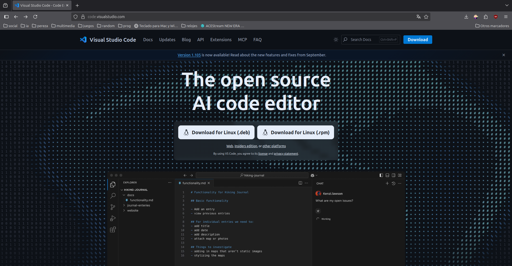
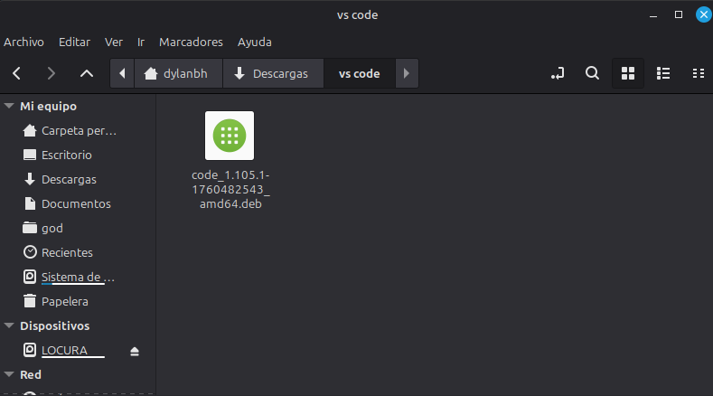
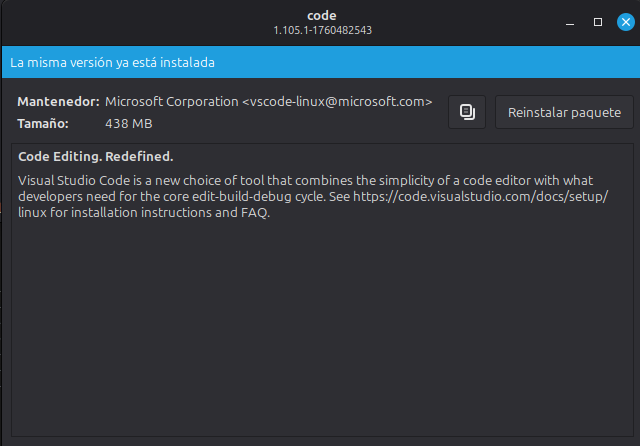
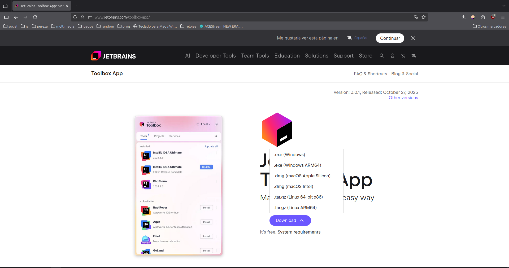
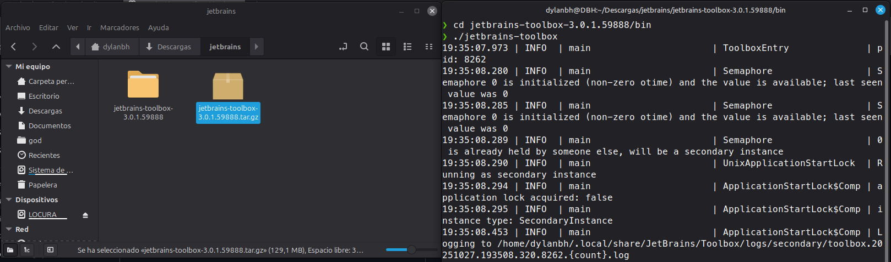
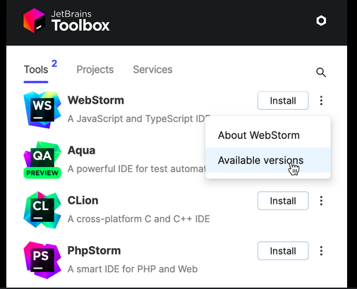
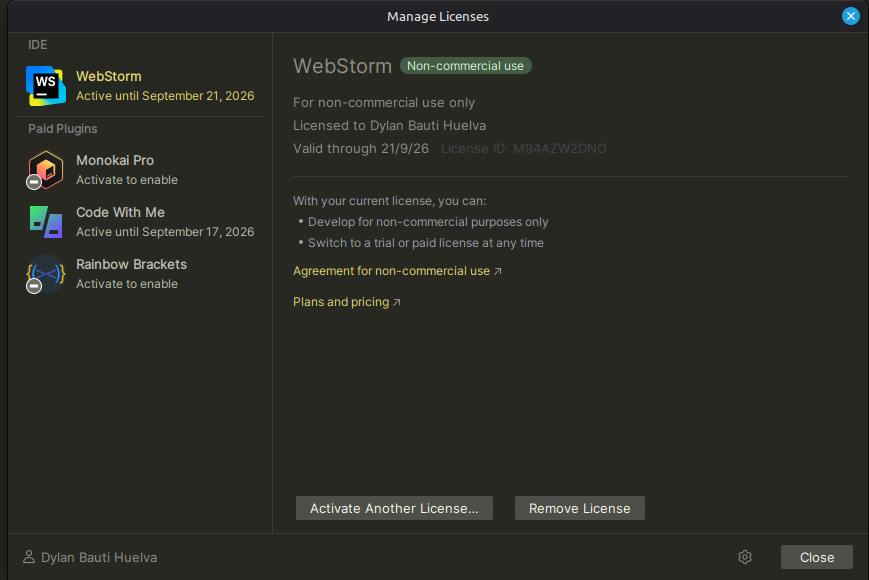

# Punto 1: Instalación de entornos de desarrollo, propietarios y libres

## IDEs utilizados
- **IDE 1:** Visual Studio Code 1.105.1
- **IDE 2:** Webstorm 2025.2.4

## Descripción de la tarea
*   **Visual Studio Code:**

    *   **En Linux (Ubuntu):**
        *  **Descarga:** Desde la misma web, bajé el archivo de instalación para Linux (un paquete `.deb`).
        *  **Instalación desde la Terminal:** Desde el gestor de archivos, lo instalé haciendo doble clic sobre el `.deb`. El sistema se encargó de descargar lo que hiciera falta.
        *  **Listo:** Después de la instalación, el programa ya aparecía en el menú de aplicaciones.

*   **WebStorm:**

    *   **En Linux (Ubuntu) (usando la Toolbox de JetBrains):**
        1.  **Descargar la "Toolbox App":** JetBrains ofrece una aplicación llamada "Toolbox", que centraliza la gestión de sus herramientas de desarrollo. Accede al [sitio web oficial de JetBrains](https://www.jetbrains.com/toolbox-app/) y descarga el paquete correspondiente a Linux.
        2.  **Descomprimir el archivo descargado:** Normalmente, el archivo descargado es un paquete comprimido (por ejemplo, `.tar.gz`). Para descomprimirlo, abre una terminal y navega al directorio donde lo descargaste. Usa el comando `tar -xzf nombre_del_archivo.tar.gz` para extraer el contenido.
        3.  **Ejecutar la Toolbox App:** Ingresa a la carpeta que se creó al descomprimir el archivo. Allí encontrarás un archivo ejecutable llamado `jetbrains-toolbox`. Hazlo ejecutable si es necesario (`chmod +x jetbrains-toolbox`) y luego inicia la aplicación con `./jetbrains-toolbox`.
        4.  **Instalar WebStorm:** Una vez abierta la Toolbox App, utiliza la barra de búsqueda para encontrar "WebStorm". Haz clic en el botón "Instalar" junto al nombre del programa. La Toolbox descargará e instalará automáticamente WebStorm en tu sistema.
        5.  **Ejecutar WebStorm:** Cuando termine la instalación, puedes iniciar WebStorm directamente desde la Toolbox App o buscar el lanzador en el menú de aplicaciones de tu escritorio.
        6.  **Activación:** Al iniciar WebStorm por primera vez, el programa solicitará la activación de la licencia. Ingresa las credenciales asociadas a tu cuenta de JetBrains o introduce el código de licencia facilitado, siguiendo las instrucciones que aparecen en pantalla.
        7.  **Configuración inicial (opcional):** Al abrir WebStorm por primera vez, puedes importar configuraciones previas, elegir temas, y personalizar el entorno según tus preferencias.

## Respuestas a preguntas evaluativas

### Pregunta 1: ¿Qué diferencias encontraste en el proceso de instalación entre el IDE propietario y el libre?
* La principal diferencia fue que WebStorm solicitó una licencia para usarlo. Además, WebStorm es un programa más pesado y tarda más en instalarse. VS Code es mucho más ligero y rápido.

### Pregunta 2: ¿Qué ventajas identificaste en cada uno de los entornos durante la instalación?
*   **Ventaja de VS Code:** Su simpleza y rapidez. Es fácil tenerlo funcionando en un momento.
*   **Ventaja de WebStorm:** Usar la "Toolbox App" es muy cómodo, porque desde ahí puedo instalar, actualizar y manejar todos los programas de JetBrains fácilmente.

## Evidencias
**VS Code**

---
**Webstorm**

## Observaciones
[Comentarios adicionales sobre el proceso de instalación]
