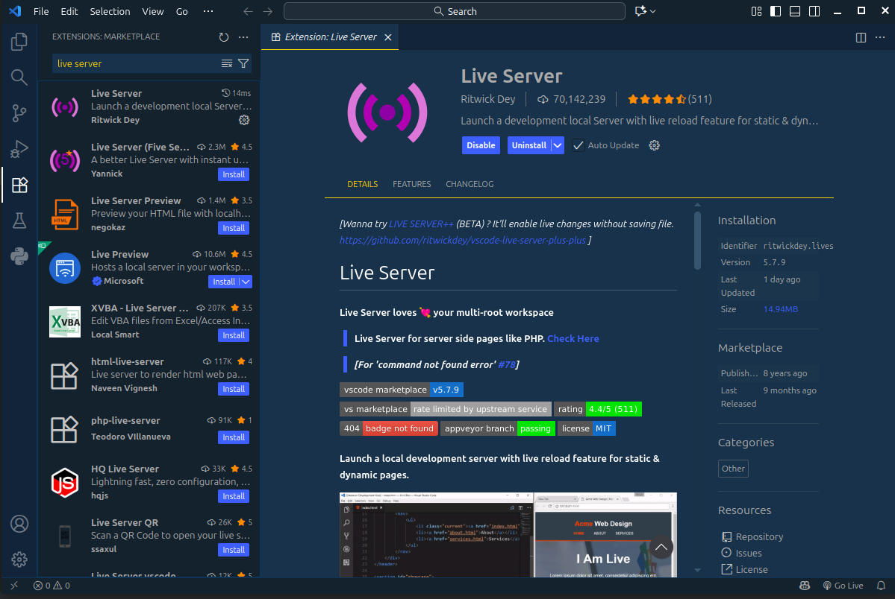
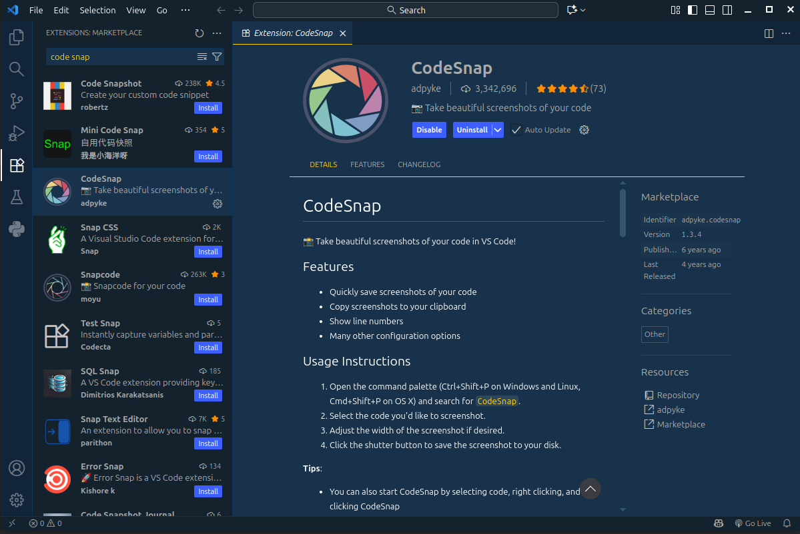
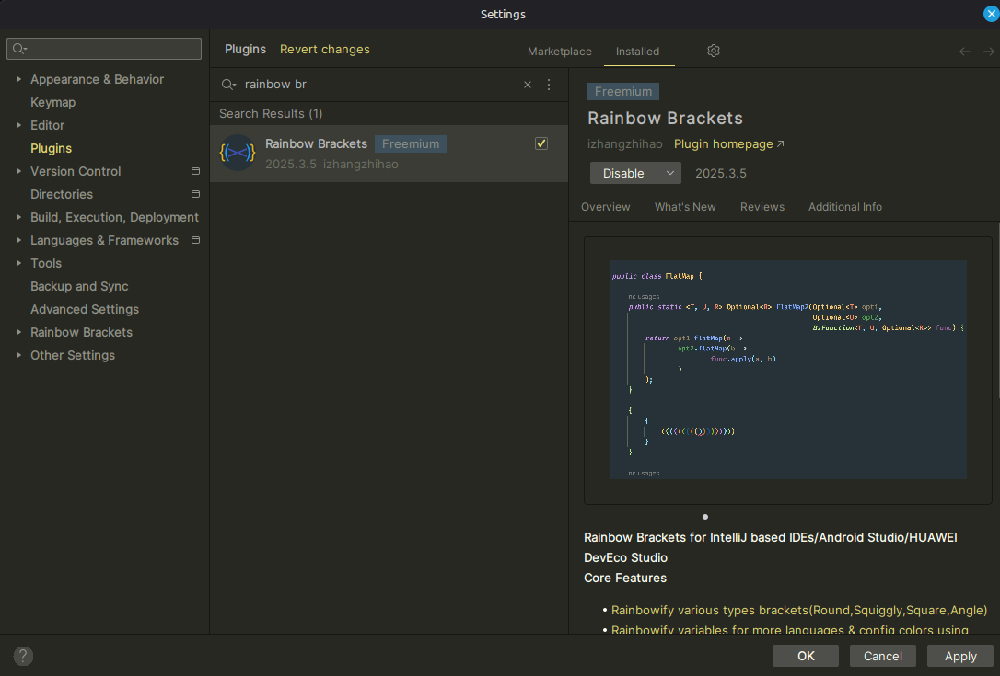
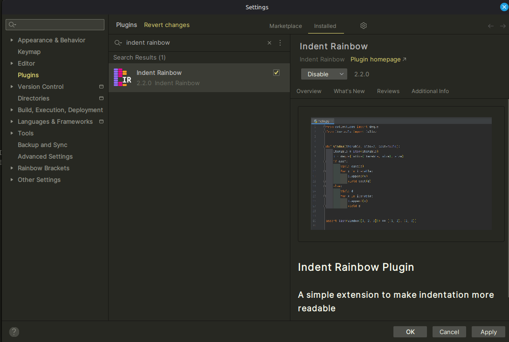
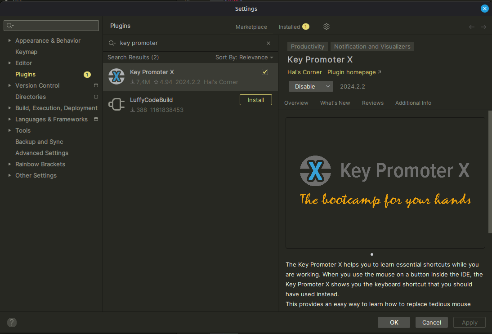

# Punto 2: Gestión de módulos y extensiones en el entorno de desarrollo

## IDEs utilizados
- **IDE 1:** Visual Studio Code 1.105.1
- **IDE 2:** Webstorm 2025.2.4

## Descripción de la tarea

* **En Visual Studio Code:** Instalé las extensiones **"Live Server"** y **"Code Snap"**. La primera crea un pequeño servidor en el ordenador que actualiza la página web en el navegador automáticamente cada vez que guardo un cambio en el código. "Code Snap" es una herramienta muy útil para crear capturas de pantalla del código directamente desde el editor.
* **En WebStorm:** Unos plugins muy útiles que instalé fueron: **"Indent Rainbow"**, que colorea las indentaciones para que sea más fácil seguir el código, **"Rainbow Brackets"**, que colorea los pares de paréntesis, corchetes y llaves para facilitar la visualización de bloques anidados y **"Key Promoter X"**, que te ayuda a aprender los atajos de teclado del IDE.

## Respuestas a preguntas evaluativas

### Pregunta 1: ¿Cómo fue el proceso de instalación de extensiones o módulos en cada IDE?
*   **En VS Code:** Fui a la pestaña de "Extensiones" en la barra lateral, busqué "Live Server" y "Code Snap", y le di al botón de "Instalar" en cada uno. El proceso es muy rápido y no requiere reiniciar el editor.
*   **En WebStorm:** Accedí a `Settings > Plugins`, busqué "Indent Rainbow", "Key Promoter X" y "Rainbow Brackets" en el Marketplace, y los instalé. Normalmente, hay que reiniciar el IDE para que los plugins se activen correctamente.

### Pregunta 2: ¿Qué beneficios proporcionan las extensiones o plugins que instalaste para el desarrollo de tus proyectos?
*   **En VS Code (Live Server y Code Snap):**
    *   **Live Server:** Hace que programar sea mucho más rápido porque veo los cambios al instante en el navegador sin tener que recargar la página a mano.
    *   **Code Snap:** Permite crear capturas de pantalla del código con un aspecto profesional, lo cual es muy útil para la documentación o para compartir fragmentos de código.
*   **En WebStorm (Indent Rainbow, Rainbow Brackets y Key Promoter X):**
    *   **Indent Rainbow** y **Rainbow Brackets** mejoran enormemente la legibilidad del código. El primero colorea los niveles de sangrado y el segundo los pares de paréntesis/llaves, ayudando a evitar errores y a entender la estructura de un vistazo.
    *   **Key Promoter X** es una herramienta de aprendizaje excelente que te notifica el atajo de teclado correspondiente a una acción que realizas con el ratón, ayudándote a ser más rápido y eficiente con el tiempo.

## Evidencias

