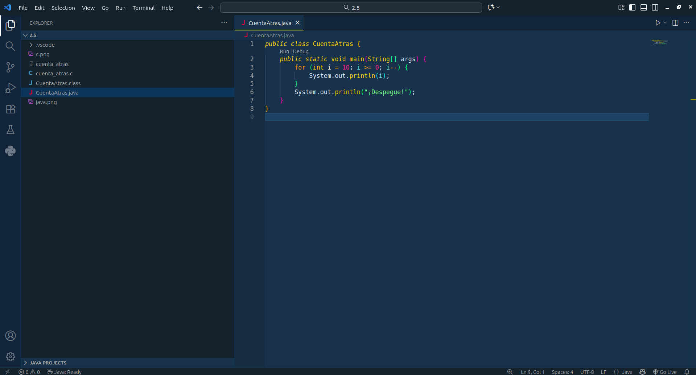
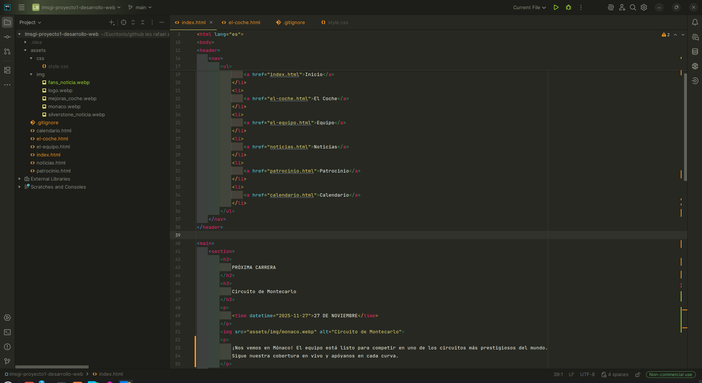
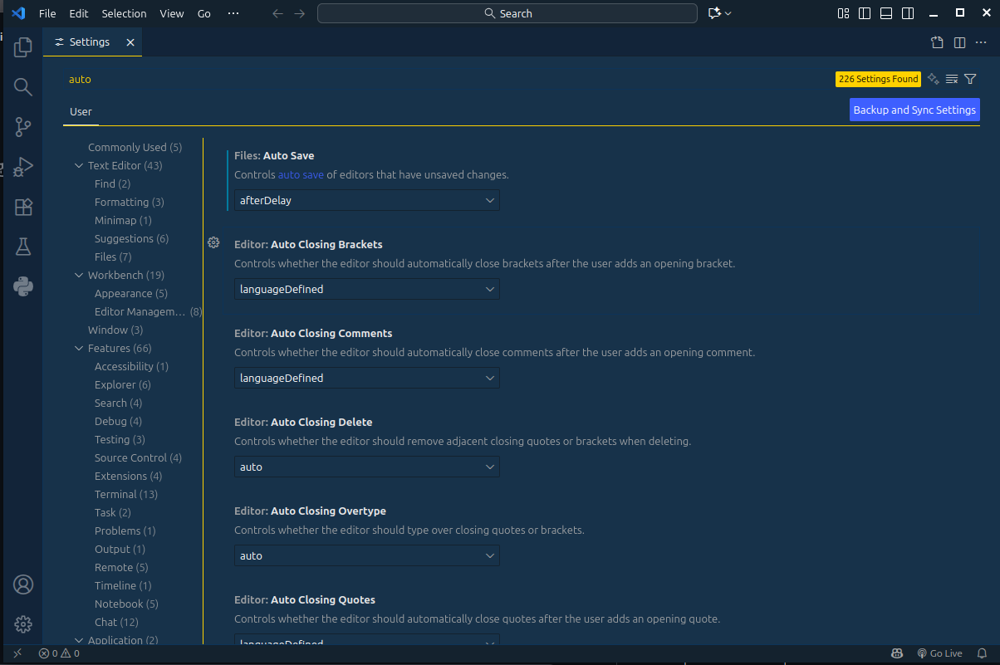

# Punto 3: Personalización y automatización del entorno

## IDEs utilizados
- **IDE 1:** Visual Studio Code 1.105.1
- **IDE 2:** Webstorm 2025.2.4

## Descripción de la tarea
*   En VS Code, seleccioné el tema "Cobalt 2" para mejorar la apariencia visual y configuré un atajo personalizado para abrir el panel de Problemas utilizando `Ctrl+Alt+P`, además de modificar algunos atajos para adaptar el entorno a mi preferencia de teclas rápidas. Para la automatización, activé la opción de "Auto Save", configurada en modo "afterDelay" para guardar los archivos automáticamente tras unos segundos de inactividad.

*   En WebStorm, seleccioné el tema "Monokai Classic" y personalicé el atajo para "Comentar/Descomentar línea", asignando la combinación `Ctrl+Alt+3`, que resulta más cómoda en mi distribución de teclado. Además, habilité la automatización para que el código se reformatee automáticamente cada vez que guardo un archivo, asegurando que el formato se mantenga consistente sin intervención manual. Estas personalizaciones han mejorado tanto la estética como la eficiencia de mi entorno de desarrollo.

### Personalizaciones realizadas
- Tema: En VS Code **Cobalt2 Theme Official** y en WebStorm **Monokai Classic**
- Atajos de teclado: En VS Code un atajo con `Ctrl+Alt+P`, se abre o cierra el panel de problemas, facilitando la revisión de errores. Y en Webstorm para comentar la linea con `Ctrl+Alt+3` ya que el `Ctrl+/` no se puede usar en el teclado español.
- Automatización: Guardado automatico de los archivos en VS Code y en Webstorm el formateo automatico del codigo tras guardarlo.

## Respuestas a preguntas evaluativas

### Pregunta 1: ¿Qué aspectos del entorno personalizaste y cómo mejoró tu experiencia de desarrollo?
*   Personalicé el entorno cambiando el **tema visual** en ambos editores para reducir el cansancio visual y permitió trabajar de manera más cómoda durante sesiones largas. Además, creé **atajos de teclado personalizados** para acciones frecuentes, como abrir el panel de problemas en VS Code y comentar/descomentar líneas en WebStorm.

### Pregunta 2: ¿Cómo configuraste la automatización de tareas y en qué te benefició durante el trabajo?
*   En VS Code, activé el **guardado automático de archivos** desde los ajustes, lo que evita pérdidas accidentales y garantiza que los cambios se guarden constantemente sin intervención manual. En WebStorm, configuré la **Reformat Code** directamente desde los ajustes, asegurando que el código esté siempre ordenado y limpio sin esfuerzo adicional.

## Evidencias
**ANTES:**

**DESPUÉS:**

**AUTOMATIZACIÓN:**

