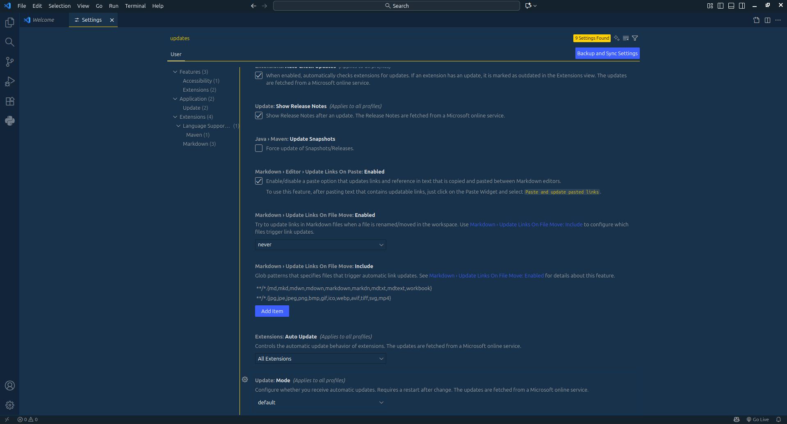
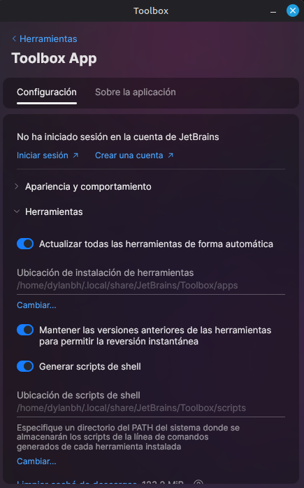

# Punto 4: Configuración del sistema de actualización del entorno de desarrollo

## IDEs utilizados
- **IDE 1:** Visual Studio Code 1.105.1
- **IDE 2:** Webstorm 2025.2.4z

## Descripción de la tarea
*   **Visual Studio Code:**
    No requiere ninguna configuración. El programa se actualiza de forma completamente automática. Viene por defecto en la opcion `default` que hace la opciones de manera automaticamente.

*   **WebStorm:**
    Para que las actualizaciones sean automáticas, solo es necesario habilitar la opción correspondiente en la **JetBrains Toolbox App**. Una vez habilitada esta función en la Toolbox App, el IDE se actualiza de forma completamente automática en segundo plano.

## Respuestas a preguntas evaluativas

### Pregunta 1: ¿Cómo configuraste las actualizaciones automáticas en cada IDE?
*   **En VS Code:** No configuré nada porque el proceso es totalmente automático.
*   **En WebStorm:** Lo único que hice fue habilitar la función de actualizaciones automáticas en la JetBrains Toolbox App; luego, el proceso es completamente automático.

### Pregunta 2: ¿Por qué es importante mantener el IDE actualizado en proyectos de desarrollo?
Es fundamental por cuatro razones muy simples:
*  **Seguridad:** Cierra posibles agujeros de seguridad que se van descubriendo.
*  **Novedades:** Permite usar las últimas características de HTML, CSS y otros lenguajes.
*  **Menos Errores:** Corrige fallos que tenía el programa y que podían ser molestos.
*  **Mejor Rendimiento:** A menudo, las actualizaciones hacen que el programa funcione más rápido.

## Evidencias

