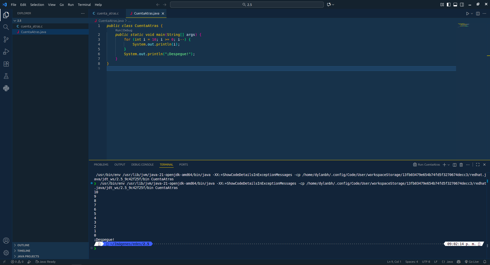
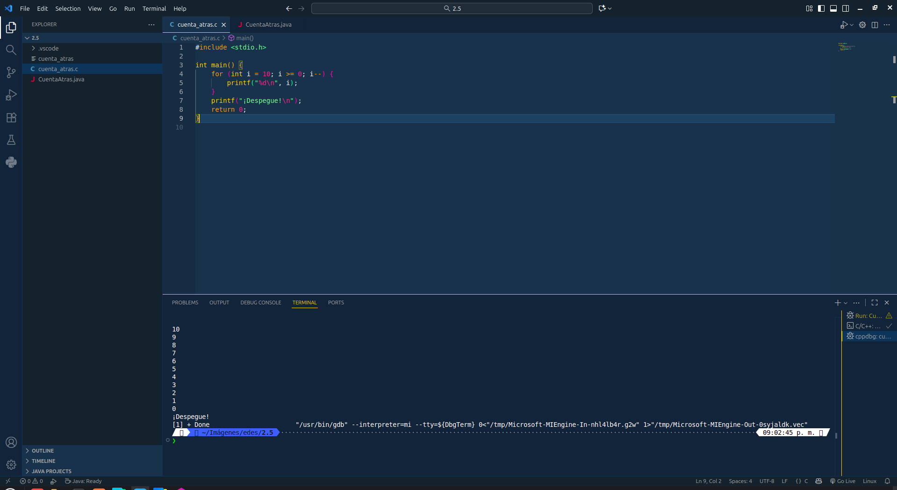

# Punto 5: Generación de ejecutables a partir de código fuente en distintos lenguajes en un mismo IDE

## IDE utilizado
- **IDE:** Visual Studio Code 1.105.1

## Descripción de la tarea
Programa "cuenta atrás" que cuenta de 10 a 0 y luego imprime "¡Despegue!"

### Lenguajes utilizados
- **Lenguaje 1:** Java
- **Lenguaje 2:** C

## Código implementado

### Lenguaje 1: Java
```java
public class CuentaAtras {
    public static void main(String[] args) {
        for (int i = 10; i >= 0; i--) {
            System.out.println(i);
        }
        System.out.println("¡Despegue!");
    }
}
```

### Lenguaje 2: C
```c
#include <stdio.h>

int main() {
    for (int i = 10; i >= 0; i--) {
        printf("%d\n", i);
    }
    printf("¡Despegue!\n");
    return 0;
}
```

## Respuestas a preguntas evaluativas

### Pregunta 1: ¿Cuál fue el proceso para ejecutar el mismo programa en diferentes lenguajes dentro del mismo IDE?
*  **En VS Code**, primero abrí los archivos `CuentaAtras.java` y `cuenta_atras.c`. Para Java, instalé el plugin de Java, ejecutarlo gracias a este es muy facil solo hay que presionar el boton de play en la esquina superior derecha. Para C, instalé la extensión de C/C++, ejecutarlo también fue sencillo solo necesité presionar el boton de play en la esquina superior derecha. VS Code reconoce ambos lenguajes y facilita la ejecución con sus extensiones.

### Pregunta 2: ¿Qué diferencias encontraste en la generación del ejecutable entre los dos lenguajes?
*  **Java** requiere compilar el código fuente en bytecode (usando `javac`) para generar el archivo `CuentaAtras.class`, que luego se ejecuta con la máquina virtual de Java. **C** se compila directamente a un ejecutable nativo utilizando un compilador como `gcc`, generando un archivo ejecutable (`cuenta_atras`). 

## Evidencias

