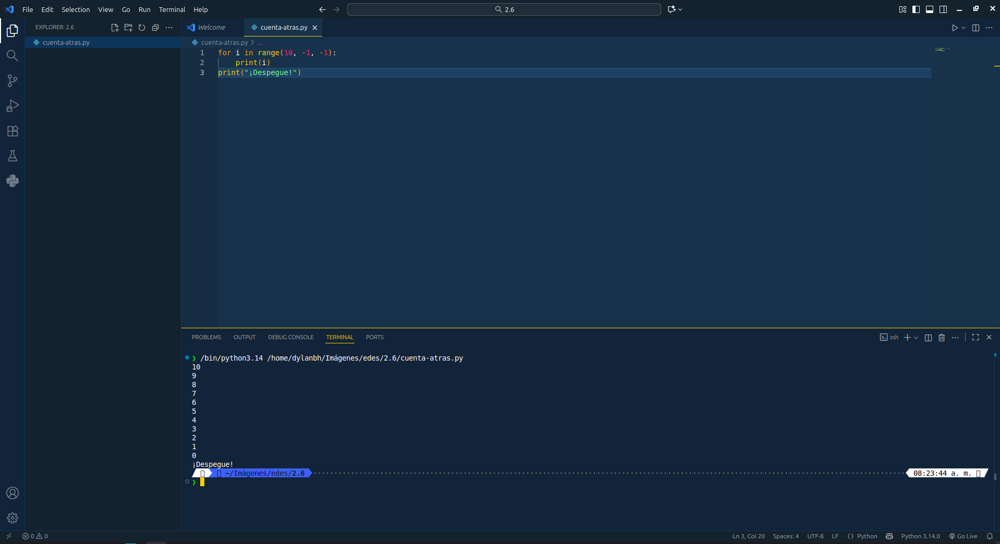
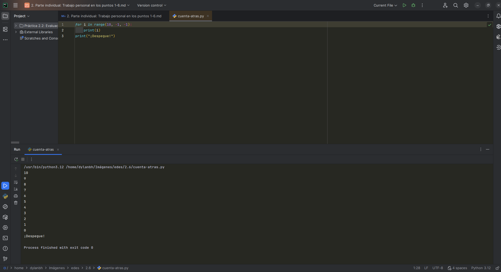

# Punto 6: Generación de ejecutables con diferentes IDEs a partir del mismo código fuente

## IDEs utilizados
- **IDE 1:** Visual Studio Code 1.105.1
- **IDE 2:** Webstorm 2025.2.4

## Descripción de la tarea
Programa "cuenta atrás" en Python que cuenta de 10 a 0 y luego imprime "¡Despegue!"

## Código implementado

```python
for i in range(10, -1, -1):
    print(i)
print("¡Despegue!")
```

## Respuestas a preguntas evaluativas

### Pregunta 1: ¿Qué diferencias encontraste al ejecutar el mismo código fuente en diferentes IDEs?
*   **En VS Code:** La ejecución se realiza abriendo el archivo y presionando el botón "Run Python File" en la esquina superior derecha, o usando el terminal integrado con el comando `python cuenta_regresiva.py`. Puede requerir instalar la extensión de Python si no está instalada.
*   **En PyCharm:** Al abrir el archivo, basta con hacer clic derecho y seleccionar "Run 'cuenta_regresiva'", o utilizar el botón de ejecución que aparece automáticamente. PyCharm detecta el entorno de Python y configura el intérprete de forma automática (en la mayoría de los casos).
*   La principal diferencia es que PyCharm ofrece un entorno más integrado para Python, mientras que VS Code requiere la instalación de extensiones y algunas configuraciones iniciales.

### Pregunta 2: ¿Cuál de los IDEs te pareció más cómodo o eficiente para ejecutar el código Python o el lenguaje que hayas elegido? ¿Por qué?
*   **PyCharm** fue el más cómodo para ejecutar código Python, ya que todo viene preconfigurado y enfocado en desarrollo Python. El botón de ejecución y la gestión de entornos virtuales están integrados, lo que facilita el proceso.
*   **Visual Studio Code** es más ligero y versátil para otros lenguajes, pero requiere instalar la extensión de Python y configurar el entorno, lo que puede tomar tiempo si es la primera vez. Una vez configurado tambien es muy rápido.

## Evidencias



## Observaciones
[Comentarios adicionales]
