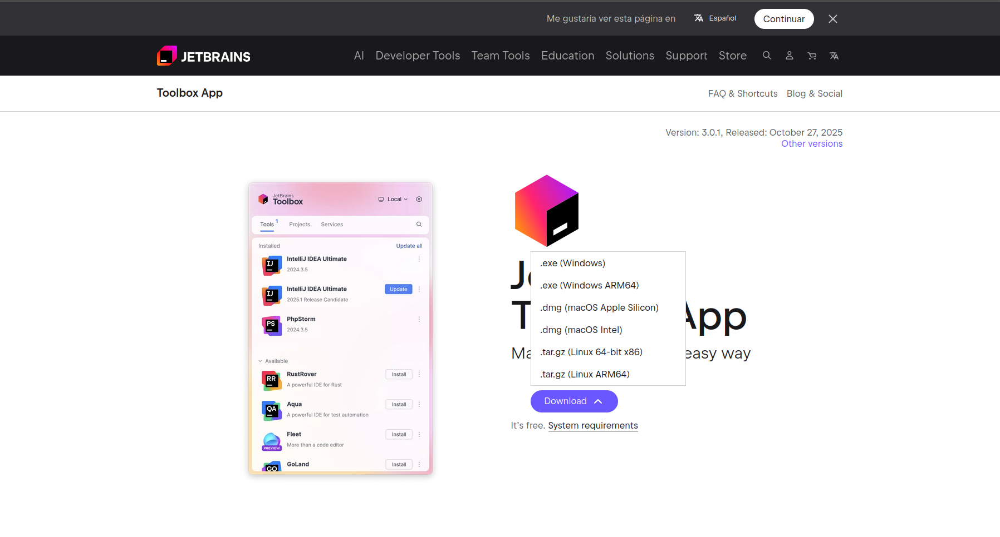
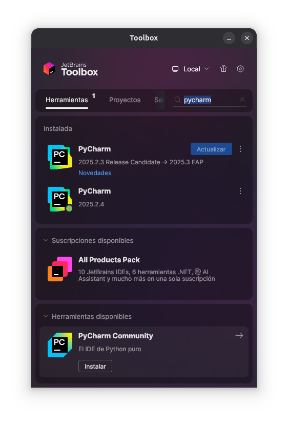
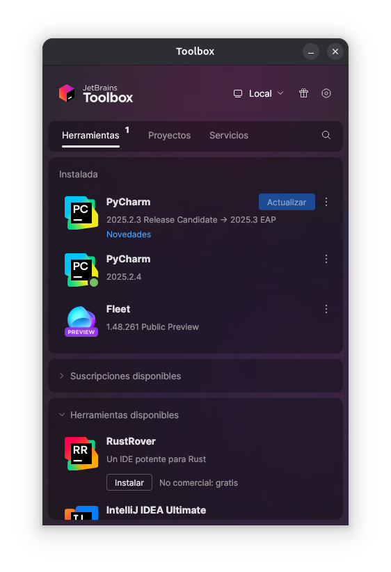

# Punto 1: Instalación de entornos de desarrollo, propietarios y libres

## IDEs utilizados
- **IDE 1:** [Pycharm Professional] - Versión 25.2.4
- **IDE 2:** [Fleet] - Versión 1.48.261

## Descripción de la tarea
Explico todo el proceso de instalación de ambos IDEs, sistema operativo utilizado, etc.

## Proceso de instalación

**1. Instalación de la toolbox de Jetbrains**

- Acceder a la página de la Toolbox de Jetbrains (https://www.jetbrains.com/toolbox-app/)

    

- En Windows, descarga el instalador (.exe) desde la página y ejecuta el archivo para acceder a la Toolbox.
- En Linux, descarga el archivo (.tar.gz), descomprímelo mediante el comando (unzip <nombre_del_archivo>.zip -d ./<nombre_carpeta_destino>). Una vez descomprimido en la carpeta haz doble clic en el ejecutable y a partir de esa ejecución aparecera en el apartado de aplicaciones.
- En macOS, descarga el archivo (.dmg), abre el archivo y añade la Toolbox a tu carpeta de Aplicaciones.

**2. Instalación de los IDEs**

- Buscamos el IDE
- Pulsamos el botón de instalar

    

- Listo para ejecutar 

    

## Respuestas a preguntas evaluativas

### Pregunta 1: ¿Qué diferencias encontraste en el proceso de instalación entre el IDE propietario y el libre?
- La diferencia que he encontrado es que para acceder a Pycharm Professional requieres de una suscripción o una cuenta de estudiante mientras que para Fleet solo necesitas descargarlo.
### Pregunta 2: ¿Qué ventajas identificaste en cada uno de los entornos durante la instalación?
- No noté ninguna diferencia de instalacion ya que ambos forman parte de la Toolbox de Jetbrains asi que el proceso de instalación es el mismo.
