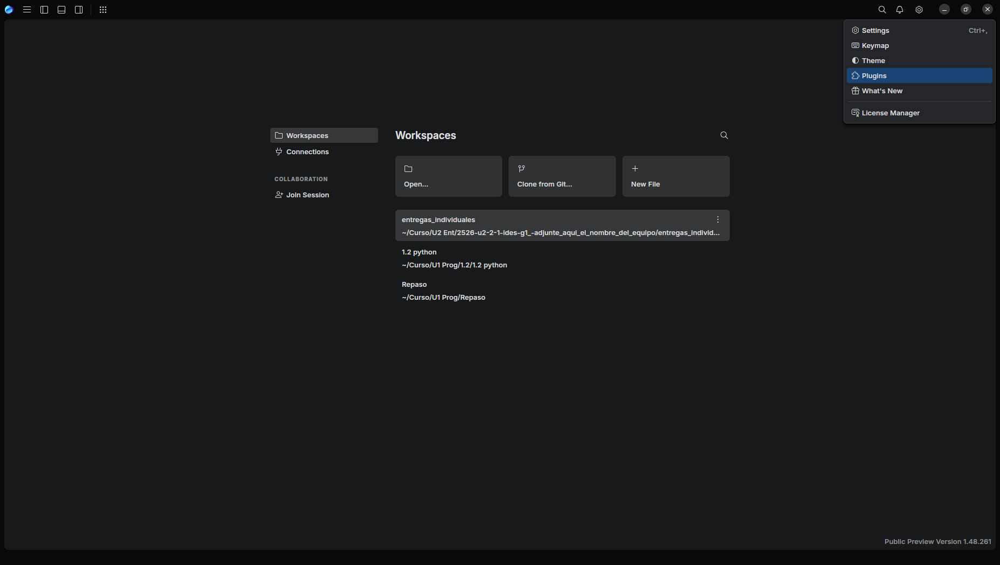
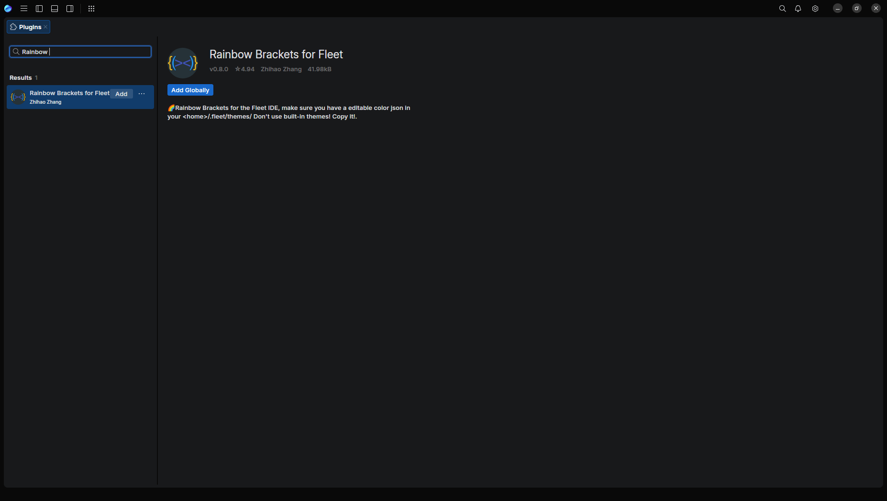
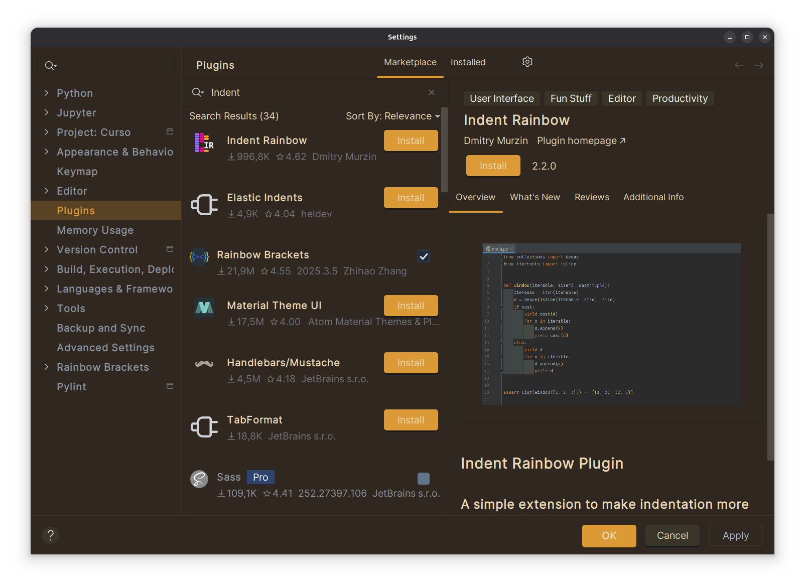

# Punto 2: Gestión de módulos y extensiones en el entorno de desarrollo

## IDEs utilizados
- **IDE 1:** Pycharm Professional - Versión 25.2.4
- **IDE 2:** Fleet - Versión 1.48.261

## Descripción de la tarea
En este punto enseño como instalé los plugins y qué plugins instalé.

- En Fleet: Rainbow Brackets for Fleet
- En Pycharm: InlineError, One Puintxi Theme, InlineError, Pylint, Indent Raimbow y Rainbow Brackets. 

## Respuestas a preguntas evaluativas

### Pregunta 1: ¿Cómo fue el proceso de instalación de extensiones o módulos en cada IDE?

**Fleet**
- En fleet debemos ir al engranaje.
- Clicamos en el apartado plugins.

    
  
- Buscamos el plugin que queramos.
- Pulsamos el botón de instalar.

    

**Pycharm**
- En Pycharm debes ir al menu File>Settings.
- Hacemos clic en Plugins y buscamos el que queramos.
- Una vez encontrado le damos a instalar y listo.

    

### Pregunta 2: ¿Qué beneficios proporcionan las extensiones o plugins que instalaste para el desarrollo de tus proyectos?
Los plugins instalados me benefician en muchos aspectos, ya sea a nivel visual como el tema, raimbow brackets que marca los parentesis, corchetese, etc de otro color o Indent Raimbow que me permite ver a que nivel de indentacion esta cada cosa de manera sencilla. 
A nivel desarrollo de software tengo por ejemplo Pylint y InlineError que me permiten ver errores que he cometido a la hora de desarrollar mi código.
