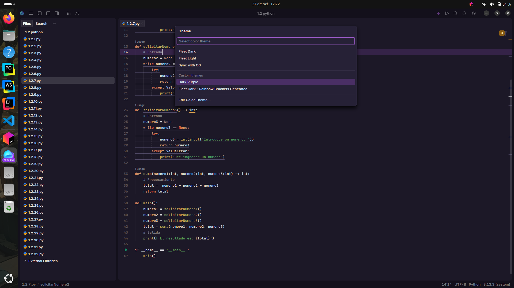
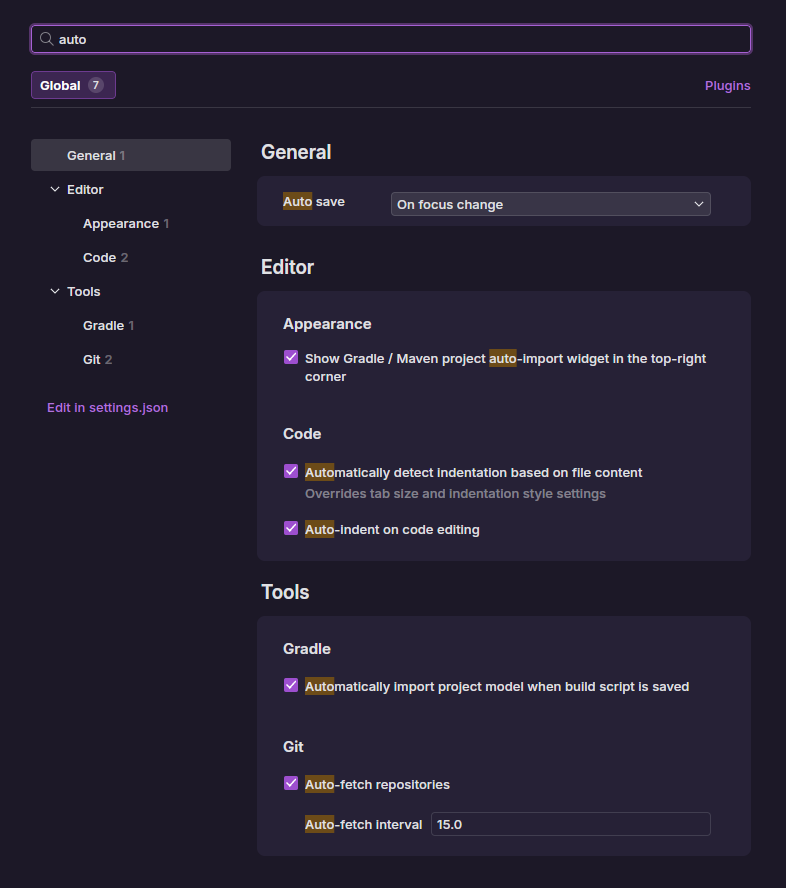
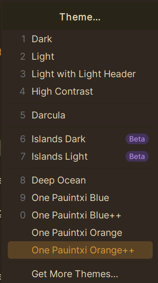

# Punto 3: Personalización y automatización del entorno

## IDEs utilizados
**IDE 1:** [Pycharm Professional] - Versión 25.2.4
**IDE 2:** [Fleet] - Versión 1.48.261

## Descripción de la tarea
[Explica qué personalizaciones realizaste: tema, atajos de teclado, automatización de tareas]

### Personalizaciones realizadas
**Fleet:**
- Tema: Dark Purple

    
  
- Atajos de teclado: New Terminal > ctrl + shift + z

- Automatización: Indentación automática

    

**Pycharm**

- Tema: One Pauxiti Orange ++

    

- Atajos de teclado: New Terminal > ctrl + shift + z

- Automatización: Adicion de los progrmas con extension .py a src

    

## Respuestas a preguntas evaluativas

### Pregunta 1: ¿Qué aspectos del entorno personalizaste y cómo mejoró tu experiencia de desarrollo?
Mejoró mi experiencia ya que ahora he adaptado mi IDE a mi y siento que soy más eficiente a la hora de desarrollar código.

### Pregunta 2: ¿Cómo configuraste la automatización de tareas y en qué te benefició durante el trabajo?
En fleet es una opcion que viene por defecto desactivada pero que mejora la experiencia de creación del código. En Pycharm es más lioso ya que hay que acceder mediante los ajustes, Tools y External Tools y ahí es donde se deben crear las automatizaciónes.
