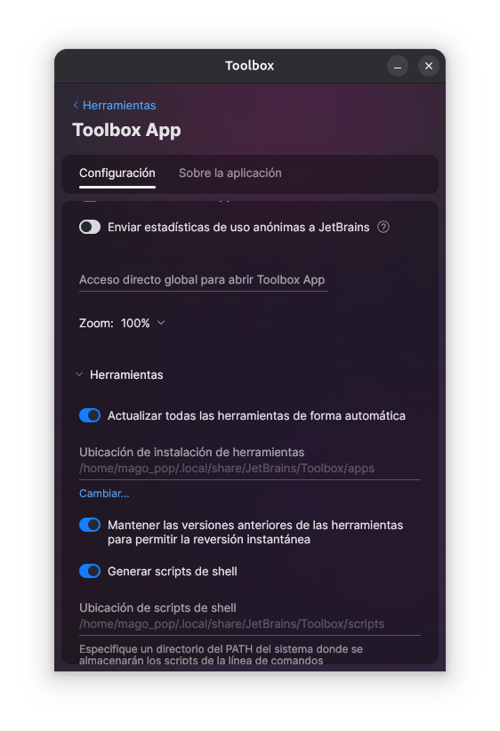

# Punto 4: Configuración del sistema de actualización del entorno de desarrollo

## IDEs utilizados
**IDE 1:** [Pycharm Professional] - Versión 25.2.4
**IDE 2:** [Fleet] - Versión 1.48.261

## Descripción de la tarea
Explico como automatizé las actualizaciones de los IDEs

## Respuestas a preguntas evaluativas

### Pregunta 1: ¿Cómo configuraste las actualizaciones automáticas en cada IDE?
Ambos IDEs se configuran desde la Toolbox, ya que la propia Toolbox de Jetbrains permite actualizar de forma automática las herramientas.

### Pregunta 2: ¿Por qué es importante mantener el IDE actualizado en proyectos de desarrollo?
Porque suelen ser más seguras, adquirir nuevas funcionalidades que pueden mejorar tu productividad.

