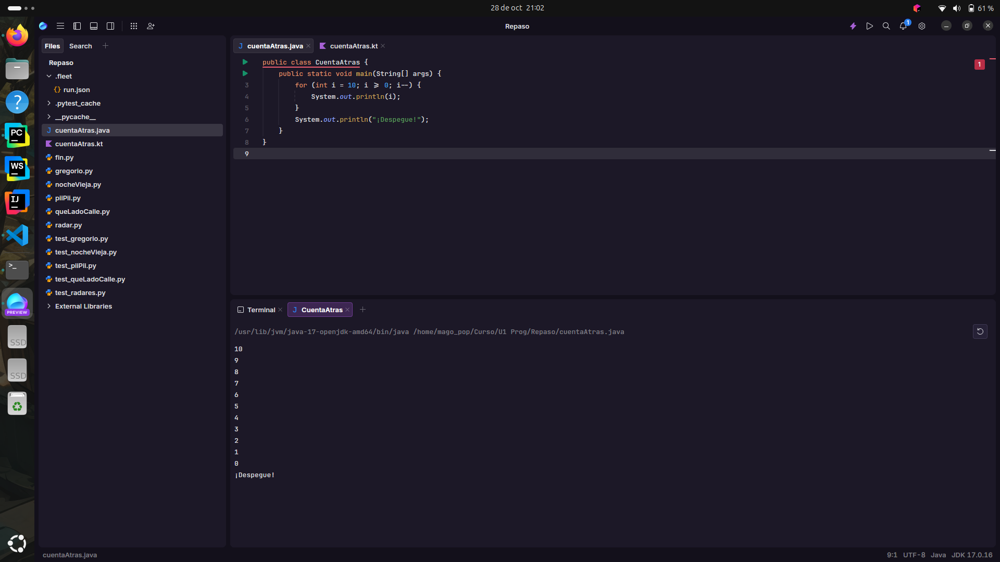
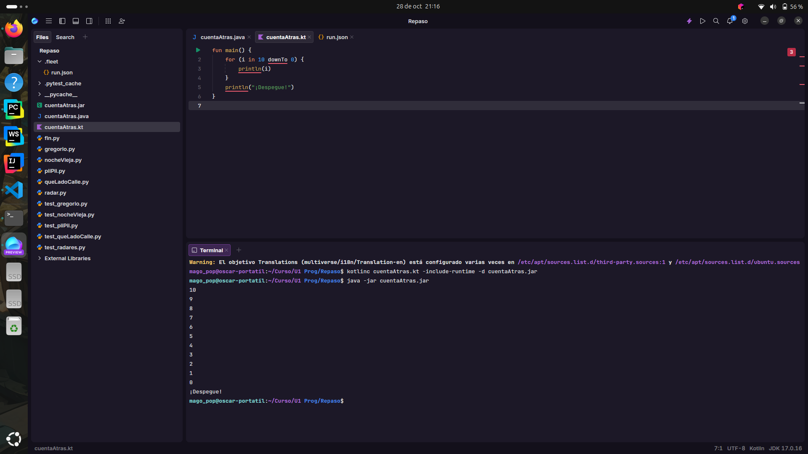

# Punto 5: Generación de ejecutables a partir de código fuente en distintos lenguajes en un mismo IDE

## IDE utilizado
- **IDE:** **IDE 1:** [Fleet] - Versión 1.48.261

## Descripción de la tarea
Programa "cuenta atrás" que cuenta de 10 a 0 y luego imprime "¡Despegue!"

### Lenguajes utilizados
- **Lenguaje 1:** [Java]
- **Lenguaje 2:** [Kotlin]

## Código implementado

### Lenguaje 1: [Java]
```
    public class CuentaAtras {
        public static void main(String[] args) {
            for (int i = 10; i >= 0; i--) {
                System.out.println(i); 
            }

            System.out.println("¡Despegue!");
        }
    }
```

### Lenguaje 2: [Java]
```
    fun main() {
        for (i in 10 downTo 0) {
            println(i)
        }
        println("¡Despegue!")
    }
```

## Respuestas a preguntas evaluativas

### Pregunta 1: ¿Cuál fue el proceso para ejecutar el mismo programa en diferentes lenguajes dentro del mismo IDE?
El proceso es diferente, ya que al no tener el Gradle para commit he tenido que hacerlo mediante comandos mintras que para Java si tenia ejecucion automatica tras crear el ejecutable.

### Pregunta 2: ¿Qué diferencias encontraste en la generación del ejecutable entre los dos lenguajes?
Kotlin me lo ha puesto más difícil, ya que he necesitado descargarlo mientras que Java ha sido más sencillo, en un IDE más común como Intellij Idea no pasa esto, es porque Fleet está en prevew.

**Java**



**Kotlin**


