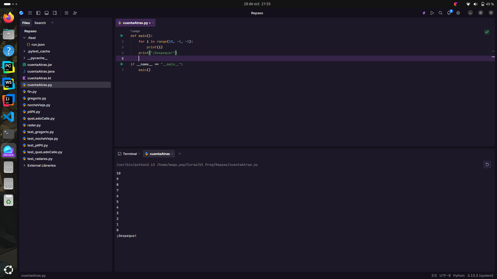
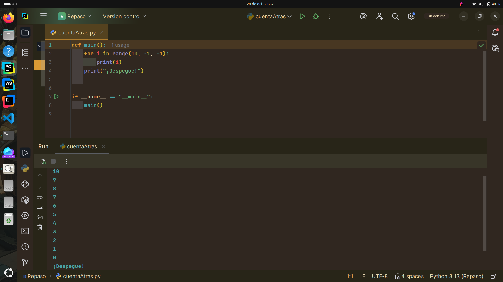

# Punto 6: Generación de ejecutables con diferentes IDEs a partir del mismo código fuente

## IDEs utilizados
- **IDE 1:** [Pycharm Professional] - Versión 25.2.4
- **IDE 2:** [Fleet] - Versión 1.48.261

## Descripción de la tarea
Programa "cuenta atrás" en Python que cuenta de 10 a 0 y luego imprime "¡Despegue!"

## Código implementado

```python
def main():
    for i in range(10, -1, -1):
        print(i)
    print("¡Despegue!")

if __name__ == "__main__":
    main()
```

## Respuestas a preguntas evaluativas

### Pregunta 1: ¿Qué diferencias encontraste al ejecutar el mismo código fuente en diferentes IDEs?
No encontré ninguna diferencia, puesto que ambos tienen nativamente el intérprete de python y la forma de ejecución es igual.

### Pregunta 2: ¿Cuál de los IDEs te pareció más cómodo o eficiente para ejecutar el código Python o el lenguaje que hayas elegido? ¿Por qué?
Para mi el IDE más comodo ha sido Pycharm, ya que está especializado en Python, está mucho mejor optimizado, puesto que a Fleet todavia le queda desarrollo.

**Fleet**



**Pycharm**


